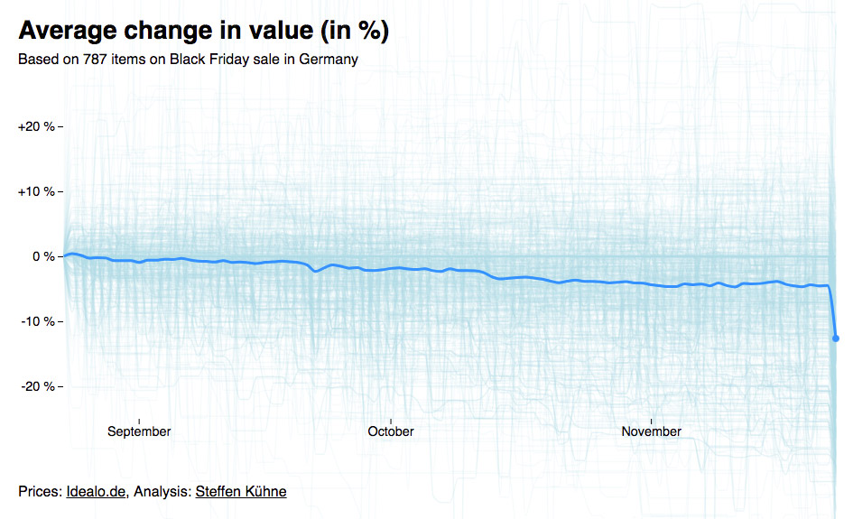

# Are Black Friday deals worth it?

No, Black Friday deals are trying to get you to buy something you probably don't need and never intended to buy in the first place. On the other hand, you might save about 12% on average.



**See the discussion on Reddit**: https://www.reddit.com/r/dataisbeautiful/comments/9znuf7/oc_are_black_friday_deals_worth_it/

The analysis was done on my lunch break and compares the cheapest available prices for 787 items on the German price comparison website [Idealo.de](https://www.idealo.de/). Therefore, all statements and interpretations can only be applied to the German online retail market. This project is based on my analysis of the [The GPU Price Surge](https://github.com/stekhn/gpu-price-surge-analysis).

### Usage

1. Clone repository `git clone https://github.com/stekhn/black-friday.git`
2. Install dependencies `npm install`
3. Start a local web server `npm start`

### Data

The data was scraped from the Idealo, a German price comparison website. The list of items was compiles from Idealo's [Black Friday list](https://www.idealo.de/preisvergleich/ProductCategory/28228.html). See the full list of products here: [data/product-list.json](https://github.com/stekhn/black-friday/blob/master/data/product-list.json)

And that's how the data is structured:

```javascript
[
  {
    "id": "5115308",
    "name": "Apple AirPods",
    "url": "https://www.idealo.de/preisvergleich/OffersOfProduct/5115308_-airpods-apple.html"
  },
  {
   // ... many more items
  }
]
```

### Scraping

Idealo provides an API endpoint for price history (which they use to render nice price chart on their website): `https://www.idealo.de/offerpage/pricechart/api/PRODUCTID?period=P3M`

Requesting this URL with the Apple Airpods product ID will return a JSON object:

```javascript
{
  "country": "DE",
  "data": [
    {
      "x": "2018-08-23",
      "y": 134.9
    },
    {
      // ... many more data points
    }
  ],
  "startDate": "2018-08-23",
  "availableSinceDate": ""
}
```

I'm using the product IDs from the product list to make the requests and fetch the data for the last 3 month.

```
$ node getPriceHistory.js
```

When everything goes well, the data is saved in [data/product-prices.json](https://github.com/stekhn/black-friday/blob/master/data/product-prices.json).

By changing parameters in the request URL, it's possible to get a price history for up to one year: `?period=P1Y` 

### Analysis

The create a common baseline for plotting the data, it makes sense to calculate the percental change from the initial price (relative value), instead of the using the real price (absolute value).

```
$ node calculatePercentages.js
```

The percentages get saved in [data/product-percentages.json](https://github.com/stekhn/black-friday/blob/master/data/product-prices.json).

### Chart

The chart was build with [D3.js](https://d3js.org/) using the [Canvas API](https://developer.mozilla.org/en-US/docs/Web/API/Canvas_API) for better performance.

### Acknowledgments
- The chart is based on Mike Bostock's [Canvas line chart example](https://bl.ocks.org/mbostock/1550e57e12e73b86ad9e) 
